# English | Türkçe
[English](README.md) | [Türkçe](README_TR.md)

# Wazuh ile Windows Server Brute-Force Alert Senaryosu

Bu proje, tamamen kontrollü bir laboratuvar ortamında oluşturulan bir SIEM senaryosunu içermektedir. Amaç, Windows Server üzerinde gerçekleşen başarısız RDP oturum açma denemelerinin Wazuh SIEM tarafından toplanması, özel kurallar ile ilişkilendirilmesi ve brute-force aktivitesi olarak tespit edilmesidir.

---

## İçindekiler

* [Amaç ve Kapsam](#amaç-ve-kapsam)
* [Lab Ortamı](#lab-ortamı-ve-kullanılan-makineler)
* [Ağ Yapılandırması](#ağ-yapılandırması)
* [Wazuh Server Kurulumu](#wazuh-server-kurulumu)
* [Windows Server'ın Wazuh Agent ile Bağlanması](#windows-serverın-wazuh-agent-ile-bağlanması)
* [Brute-Force Alert Kuralının Oluşturulması](#brute-force-alert-kuralının-oluşturulması)
* [Saldırı Simülasyonu](#saldırı-simülasyonu)
* [Windows Event Viewer Doğrulaması](#windows-event-viewer-üzerinden-doğrulama)
* [Wazuh Dashboard Doğrulaması](#wazuh-dashboard-üzerinden-alert-doğrulama)
* [Değerlendirme ve Sonuç](#değerlendirme-ve-sonuç)

---

# Amaç ve Kapsam

Bu çalışmanın amacı, SIEM mantığını yalnızca teorik olarak açıklamak değil, aynı zamanda uygulamalı bir savunma senaryosu ile göstermektir.

Senaryo kapsamında:

* Windows Server üzerinde başarısız RDP oturum açma denemeleri oluşturulmuştur.
* Windows Event Viewer kayıtları incelenmiştir.
* Wazuh tarafından toplanan loglar analiz edilmiştir.
* Özel kurallar kullanılarak brute-force aktivitesi tespit edilmiştir.

> Tüm işlemler VirtualBox üzerinde oluşturulan kapalı ve kontrollü bir laboratuvar ortamında gerçekleştirilmiştir.

---

# Lab Ortamı ve Kullanılan Makineler

Lab ortamı üç sanal makineden oluşmaktadır:

| Makine         | Görevi                               |
| -------------- | ------------------------------------ |
| Wazuh Server   | Log toplama, korelasyon ve dashboard |
| Windows Server | Hedef sistem                         |
| Kali Linux     | Test ve trafik üretimi               |

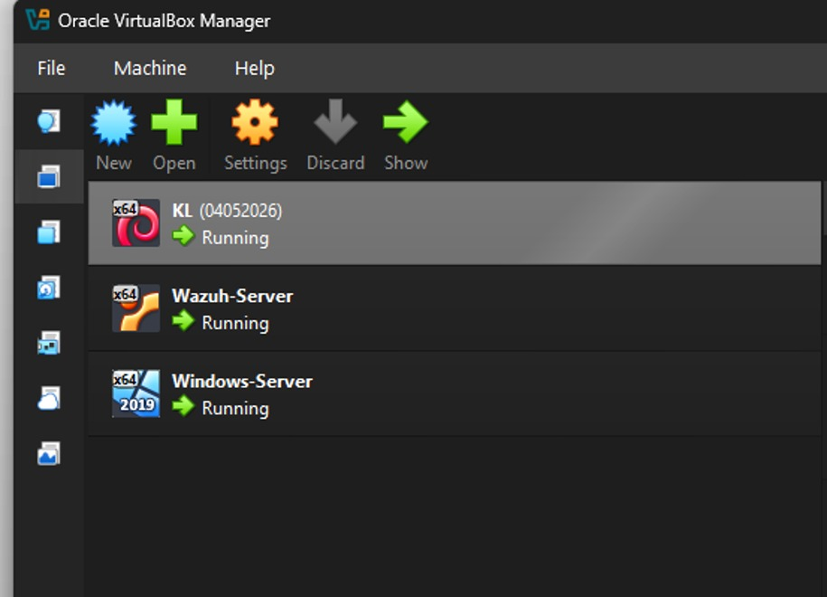

---

# Ağ Yapılandırması

Sanal makineler iki ağ adaptörü kullanacak şekilde yapılandırılmıştır.

## Adaptör 1: NAT

İnternet erişimi ve güncellemeler için kullanılmıştır.

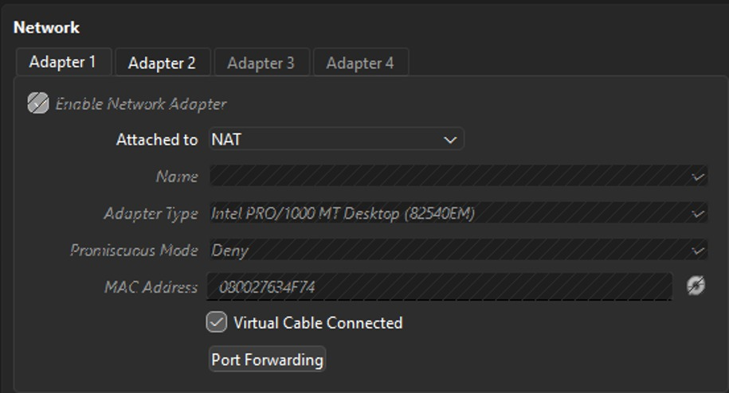

## Adaptör 2: Host-Only Adapter

Lab makinelerinin birbirleriyle haberleşmesini sağlamıştır.

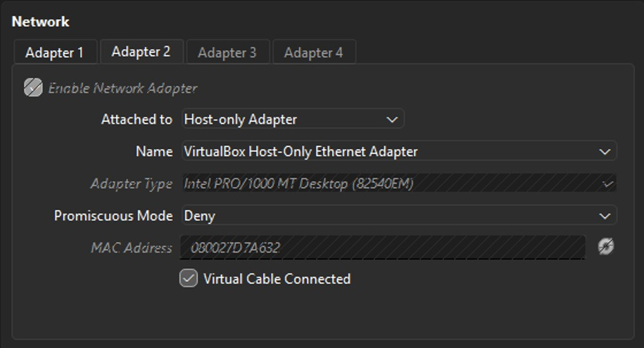

### IP Adresleri

| Sistem         | IP Adresi      |
| -------------- | -------------- |
| Wazuh Server   | 192.168.56.10  |
| Windows Server | 192.168.56.4   |
| Kali Linux     | 192.168.56.101 |

Bu yapı sayesinde brute-force denemeleri yalnızca laboratuvar ağı içerisinde gerçekleştirilmiştir.

---

# Wazuh Server Kurulumu

Kurulum Ubuntu Server üzerinde gerçekleştirilmiştir.

Kullanılan kurulum komutları:

```bash
curl -sO https://packages.wazuh.com/4.12/wazuh-install.sh
sudo bash ./wazuh-install.sh -a
```

Kurulum sonrasında:

* Wazuh Manager
* Wazuh Indexer
* Wazuh Dashboard

aynı sunucu üzerinde çalışacak şekilde kurulmuştur.

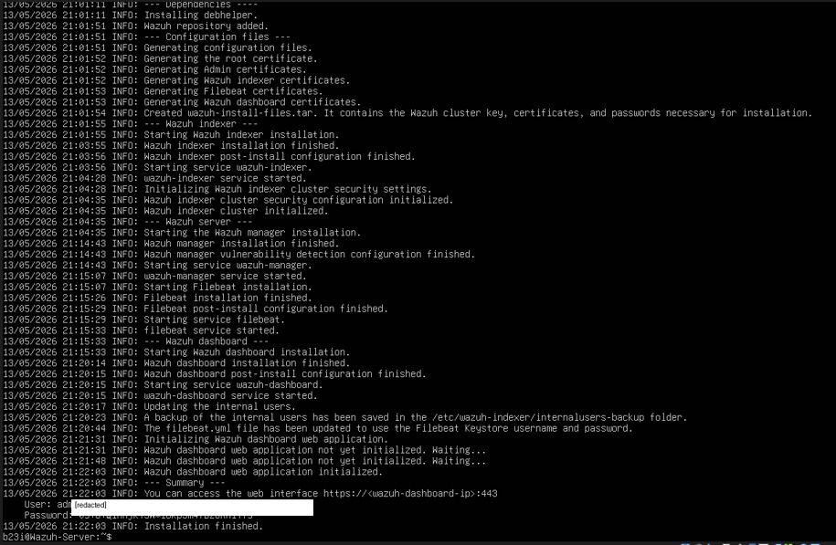

## Servis Kontrolü

```bash
sudo systemctl status wazuh-manager --no-pager
```

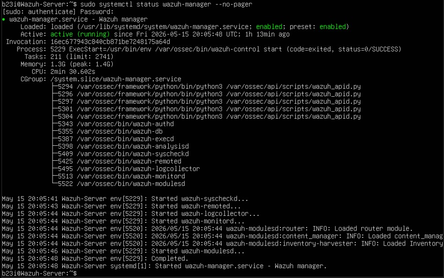

---

# Windows Server'ın Wazuh Agent ile Bağlanması

Windows Server sisteminin izlenebilmesi için Wazuh Agent kurulmuştur.

Kurulum süreci:

1. Dashboard üzerinden **Deploy New Agent** seçildi.
2. Wazuh Server IP adresi girildi.
3. Kurulum komutu Windows Server üzerinde çalıştırıldı.
4. WazuhSvc servisi başlatıldı.

Kurulum sonrasında agentın aktif olduğu doğrulanmıştır.

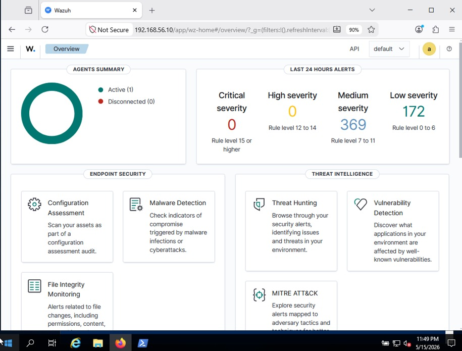

---

# Brute-Force Alert Kuralının Oluşturulması

Windows üzerinde başarısız giriş denemeleri **Event ID 4625** olarak kaydedilmektedir.

Bu çalışma kapsamında iki özel kural oluşturulmuştur:

## Rule 100100

Tek bir başarısız oturum açma olayını yakalar.

## Rule 100101

Belirli zaman aralığında tekrar eden başarısız girişleri brute-force aktivitesi olarak değerlendirir.

Üretilen alarm:

```text
LAB - Possible Windows RDP brute-force attack detected
```

MITRE ATT&CK eşleştirmesi:

```text
T1110 - Brute Force
```

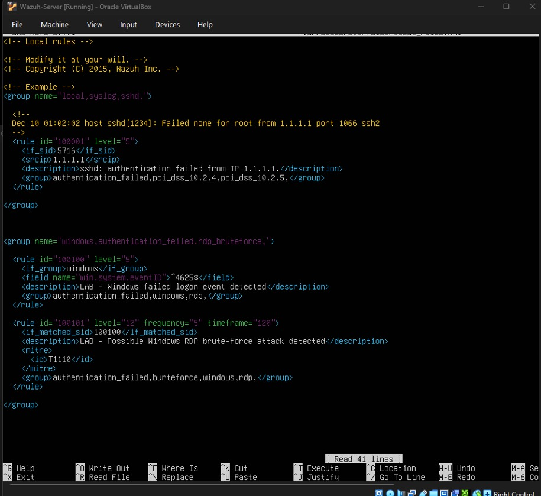

Kural tanımlandıktan sonra Wazuh Manager yeniden başlatılmıştır.

---

# Saldırı Simülasyonu

Windows Server üzerinde test amaçlı bir kullanıcı oluşturulmuştur:

```text
badguy
```

Amaç başarılı erişim elde etmek değil, başarısız giriş kayıtları üretmektir.

Hydra ile yapılan test:

```bash
hydra -l badguy -P passwords.txt -t 1 -W 3 rdp://192.168.56.4
```

Bu işlem sonucunda:

* RDP portunun açık olduğu doğrulanmıştır.
* Geçerli parola bulunamamıştır.
* Çok sayıda başarısız giriş denemesi oluşturulmuştur.

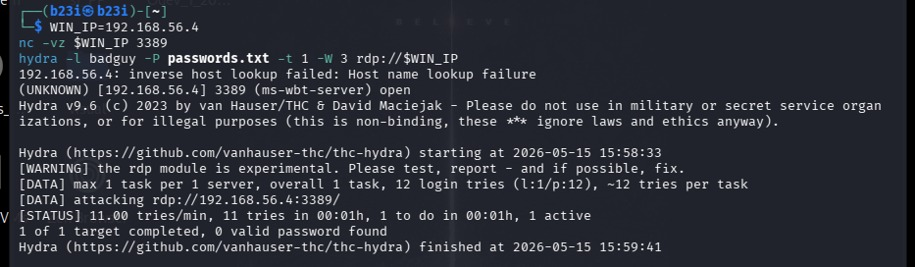

---

# Windows Event Viewer Üzerinden Doğrulama

Hydra testinden sonra Windows Event Viewer incelenmiştir.

İzlenen yol:

```text
Windows Logs
 └── Security
```

Filtreleme:

```text
Event ID: 4625
```

Başarısız giriş kayıtlarının oluştuğu doğrulanmıştır.

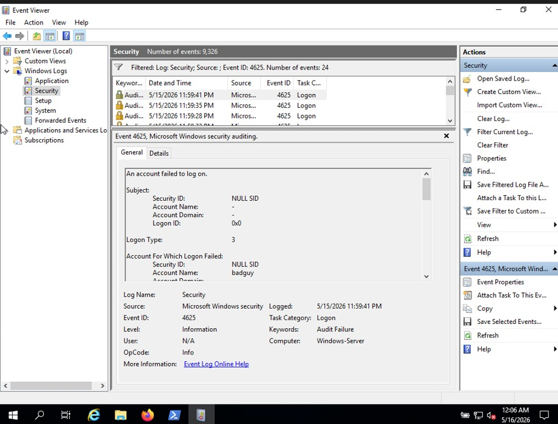

---

# Wazuh Dashboard Üzerinden Alert Doğrulama

Windows tarafında oluşan logların Wazuh'a başarıyla aktarıldığı doğrulanmıştır.

Dashboard üzerinde:

* Failed Logon Event
* Brute Force Alert

olayları görüntülenmiştir.

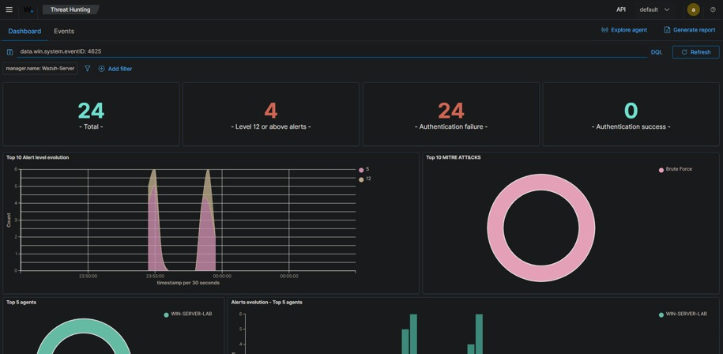

## Threat Hunting Ekranı

Threat Hunting ekranında özel kuralların çalıştığı görülmüştür.

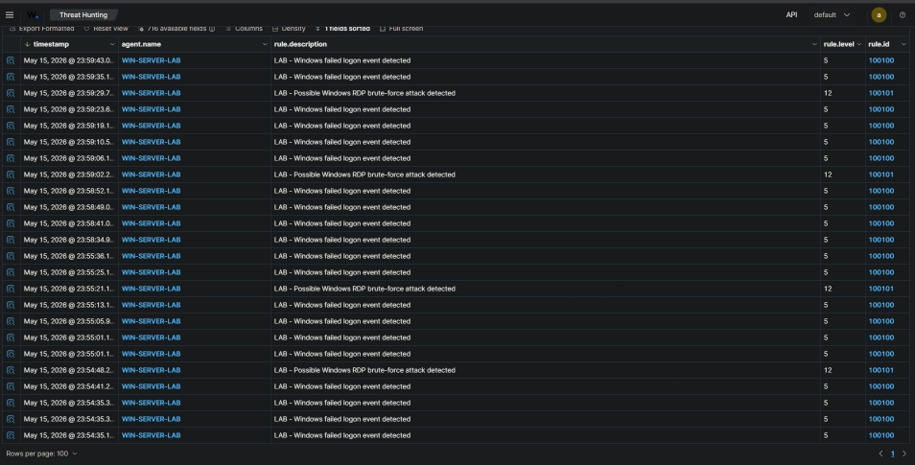

Üretilen alarmlar:

```text
LAB - Windows failed logon event detected
```

```text
LAB - Possible Windows RDP brute-force attack detected
```

Alert detaylarında saldırının geldiği kaynak IP adresi de görüntülenmiştir.

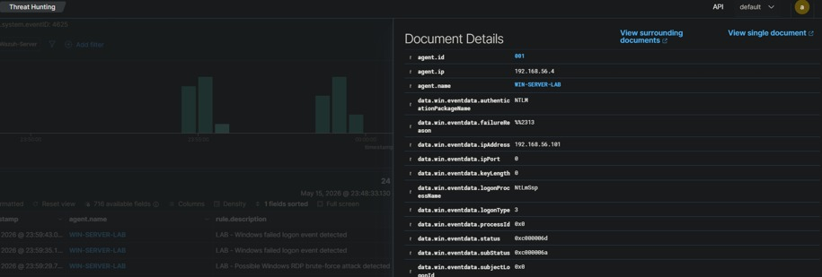

---

# Değerlendirme ve Sonuç

Bu çalışma sonucunda:

* VirtualBox üzerinde üç makineli bir savunma laboratuvarı kurulmuştur.
* Windows Server üzerinde başarısız RDP giriş denemeleri üretilmiştir.
* Wazuh Agent ile loglar merkezi olarak toplanmıştır.
* Event ID 4625 olayları özel kurallarla ilişkilendirilmiştir.
* Tekrarlayan denemeler brute-force aktivitesi olarak algılanmıştır.

## Doğrulama Noktaları

### 1. Kali Linux

Hydra ile başarısız parola denemeleri oluşturulmuştur.

### 2. Windows Event Viewer

Event ID 4625 kayıtları görüntülenmiştir.

### 3. Wazuh Dashboard

Failed logon ve brute-force alarmları doğrulanmıştır.

Bu üç aşama birlikte değerlendirildiğinde senaryonun başarıyla tamamlandığı görülmektedir.

---

# Kullanılan Teknolojiler

* VirtualBox
* Ubuntu Server
* Wazuh SIEM
* Wazuh Agent
* Windows Server
* Kali Linux
* Hydra

---

# Yazar

**Bilal İzzettin**

Defansif Güvenlik ve SIEM Laboratuvar Çalışması
